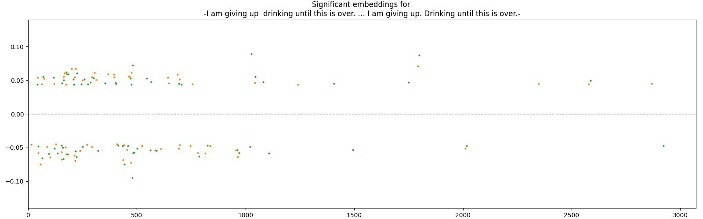
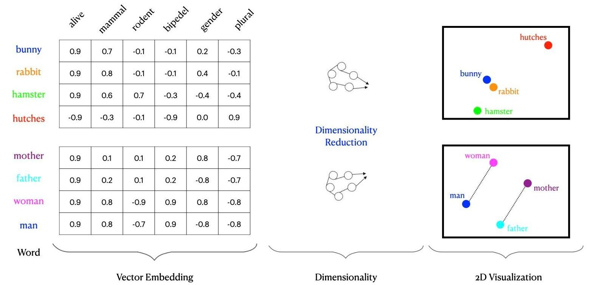
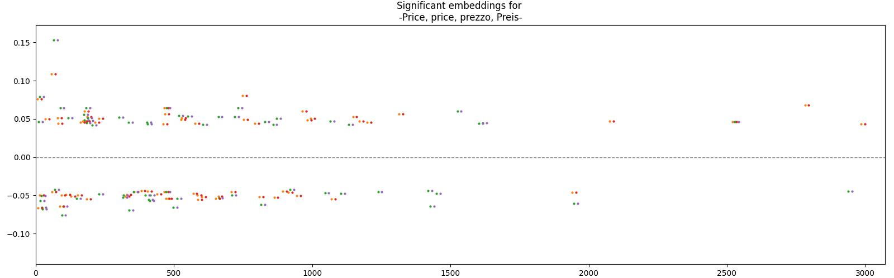
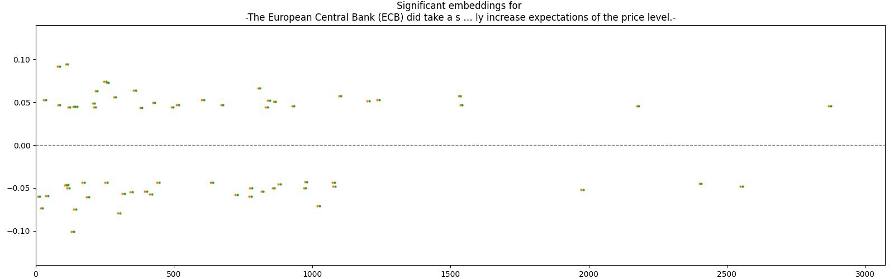

# Text classification using LLM embeddings

There has been sentiment analysis using LLMs. The empirical evidence seems very good.

---

Several upcoming projects hope to use LLMs. 

* Zareh's textual data collection on municipal taxation  
  needs to be mined for
  * Perceived `competitive networks`
  * Tax multipliers
  * Narratives
  * ...

* Kathi's projects on CbCR need an easy way 
  to extract taxation parameters from weakly structured texts 

* Geld und Währung project needs  
  good classification of official speeches  

* Financial markets - research into pension policy -  
   classify pension policy discussion against basic concepts

* Financial markets - financial literacy -  
   limits of capturing `financial calculus` with LLMs

=> Time to establish some foundations.

First research question:  

Can we use LLM embeddings to quantify text against more avanced concepts?  
Not just `favorable`  vs `unfavorable`.

Example for research into EU public finance - asset purchasing programmes - APP:  
  * Can the discussion captured by LLMs?  
  * Can text content be measured against economic theories?

Example for research into local taxation:  
    How much do municipal council statements on local business tax rates reflect on possible behavior of _surrounding_ municipalities?  
    Are there implicit expressions of thinking along the game theory concept of prisoner's dilemma?

Example for research into tax incidence:  
    How much do press releases by private companies about larger investment decisions  
    reflect on tax incentives for intellectual property?  

Example for research into pension planning:  
    How much weight is given in politicians' statements on any of the three pillars of retirement planning:  
    legal pension vs. company pensions vs. private provison?

### Validation

If we reach useful result with LLM, how to measure quality? How to validate?

Can we contract out these task to "clickworker" companies?

At what cost?

## Bag of words

How much do LLM embeddings improve on existing methods?

Is it worth the effort?

The LLM embeddings show distinct, and arguably  
better results than [bag of words](https://en.wikipedia.org/wiki/Bag-of-words_model) approach.

Example 1:  
Following statements contain identical words, with only a difference in punctuation.

* I am giving up  drinking until this is over.
* I am giving up. Drinking until this is over.

The embeddings for these two statements are .

The chart shows "significant" positive and negative values - the 32 values with the biggest magnitude.

The significant values vary. Still some dimensions overlap. Others are completely distinct.

LLMs treat punctuation as important tokens. 
Also the preceding words heavily influence the classification of a word.

## Delimination I - Language

Consider following two realms

* Reality 

* Internet language corpus

There are all kinds of differences between reality and the language corpus.  
For some, reality itself might be questionable.  
The science of linguistics researches this. 
Also [philosophy](https://en.wikipedia.org/wiki/Ludwig_Wittgenstein). 

=> We do _not_ _make_ any statement about this relationship between the internet language corpus and actual reality. 

LLMs can _only_ make claims about the second realm - only about the internet language corpus.

Consider controversial concepts, for instance [Supply-side economics](https://en.wikipedia.org/wiki/Supply-side_economics),  
which contains some more realistic assumptions (cheaper factors increase supply)  
and some debatable ones:  
An increase in supply _might_ pay for lost revenue, under more or less extreme conditions.

The LLMs can only give a probabilistic extract from the existing debate about the concept from the internet language corpus. 

## Delimination II - Generative AI

_Generative_ AI has some probabilistic element, that can lead to erroneous results,  
completely contradicting the language corpus and common sense.

For this discussion, we dont use the _generative_ faculty of LLMs.

We only use the _classification_ faculty of LLM - expressed in large vectors - the _embeddings_.

Here the margin for error is different, and arguably smaller.

The vector space consists of the "[principal components](https://en.wikipedia.org/wiki/Principal_component_analysis)"  
of the language corpus. 

As of October 2024, LLM models express the meaning of language in vectors with 3078 dimensions.

These dimensions (think `principal components`) are derived by expensive AI training. 

These "extracted features" have shown overwhelming usefulness in AI chat bots.

But the features themselves cannot be associated with words or concepts.

Rather "positivity" or "short term future", ""long term future"

## Limitations

Considerations for using  LLM vector components for classification of language.

Despite the success and usefulness of LLMs,  
many things are not well understood.

There seem be local clusters of LLM cells [associated](https://www.economist.com/science-and-technology/2024/07/11/researchers-are-figuring-out-how-large-language-models-work) with some language concepts.

There seems to be no common sense meaning for many `principal components`.

Correct classification _may_ be indicated by loadings on localized clusters.

Failed classification may be indicated by small loadings all over the vector space.

Resulting in a weak and diffuse classification. 

=> The possible errors are less problematic than the problems with hallucination in generative AI.

### Mathematical indicators for low-quality classification

* Widespread, low-magnitude values, sparse activations  
    classification is based on weak or noisy features.

* Balanced positive and negative values

---

* Higher entropy often correlates with a weak classification signal.  
   High entropy means a more "even" distribution across many dimensions. 

* Only few key features load - everything else is zero.  
  Not found in LLMs of 2024.

* Dimensional Collapse:  
    vectors for many different inputs become very similar or lie in a lower-dimensional subspace.  
      Not found in LLMs of 2024.
    
* High cosine similarity between the embeddings of _different_ classes.  
    Model does distinguishing between those classes.  
    Model is weak for differences between categories

* Visualizing embeddings in reduced dimensionality (e.g., using t-SNE or PCA),  
  embeddings should ideally form distinct clusters.

Example: Variations and translations of the word `price` all load low on dimension 87, 
and high on dimensions 528 and 57. Is this the cluster for the concept of a price in the context of economics?  
We cannot be sure at this moment.

 * Corpus is thin 
    * Little material on the German novel [Effi Briest](https://en.wikipedia.org/wiki/Effi_Briest)
    * Huge amounts of material about [Hamlet](https://en.wikipedia.org/wiki/Hamlet) 

=> Questions about _details_ about the romantic relationship between the protagonists (Hamlet and Ophelia, Effi and Crampas)  
   are answered with enormous breadth or with hallucinations drawn from U.S. movies (the next best thing).

With thin corpus coverage, the quality of classification might also suffer.

If we simply investigate _sentiment_ analysis,  
  then the categorization for `positive` and `negative` is very good,  
  even if evaluated subjects are _not_ represented in the corpus.  
  It is sufficient that the embeddings reflect the evaluating element;  
  unknown subjects load close to zero.

But even _advanced concepts of research_ seem to be captured very well in embeddings. 

Example: Purchase of government bonds by the EU

Take two statements around the concept of `central bank`, `central bank intervention`, the `market for government bonds` and important macro variables:

* The European Central Bank (ECB) did take a strongly active position in recent years by purchasing sovereign bonds of euro countries. This strongly active position of the ECB should continue.

* The European Central Bank (ECB) purchase programmes for sovereign bonds of euro countries will increase money supply and eventually increase expectations of the price level.

The data points of the _second_ series are shifted right by two pixels, in order to make the almost perfect overlap visible.

The embeddings of the two statements from a relatively specific scientific domain show strong similarities.

* Despite very different wording

* Despite having distinct sentiment (explicitly positive, implicitly negative) 

* Is this an expression of excellent categorization?  

* Or are these just extreme loadings, indicating a failure to capture meaning beyond some major anchors?

* More work needed

## Context

* Sometimes necessary.  
  The corpus on `structured bonds` may be vastly different 
   in commercial real estate than in public finance.

* If the the texts are already littered with terms from the intended domain, it might be dropped.  

* Keep it short, to reduce noisy classification.

* We can test the effect of providing context on training sets with examples.

* Sometimes the context seems to reduce the distinctions (work needed)

## Web application

The web application can be downloaded from [ZEW git](https://git.zew.de/ub-public-finance/ecb-speeches-flask).

It can be executed on your notebooks.

The web application connects to OpenAI ChatGPT 4.  
It requires an API key from OpenAI inc.  

If you request many embeddings, OpenAI may require money for it.

At least, embeddings are stored locally; openAI is only asked _once_ per text-element.

The web application allows for uploading and arranging various elements of text classification

* contexts
* benchmark statements (goal posts) 
* and texts to be classified

Some default data is loaded.  
You can change according to your reserch.

It displays embeddings and similarity as charts.

### Indexing (purely technical)

Directory   ./indexing-embeddings/autofaiss  contains some steps towards building an index for embeddings,
so that most closely matching embeddings can be searched and found quickly.

Unlike B-Tree indexes known from databases; indexes for embeddings are expensive to update.

Some index types (HNSW32) are less expensive for update, but slower in query.

Index type IVF4096 can be very fast (<15 ms) but each new vector takes a lot of computing.

Also: Each ChatGPT-O embedding needs 8 Bytes times 3078 slots space - 28 kB of data.

The indices have similar size; an index of 800.000 embeddings needs 9 GB of space.

Indices can be used as memory mapped files, but still require a lot of memory.

One should considering a large index of "stock" embeddings - and tiny "delta" indices for new data,  
being merged at night.

If needed, a distributed index across several server machines needs to be built.

## Extensions

Vector embeddings capture the general relationship between two texts but lack deep understanding of specific contexts. 

By directly engaging with a chatbot, we can get more insight into how the chatbot interprets the meaning and implications of a statement within the broader context of economics and government policies.
